# senpure io

+ [io-core](senpure-io-core) *.io 的java基础支持
+ [io-generator](senpure-io-generator) 解析*.io文件生成目标文件
+ [io-generator-ui](senpure-io-generator-ui) 基于javafx的[io-generator](senpure-io-generator)图形化操作
+ [io-server](senpure-io-server) 使用*.io约定规则进行通信的 **有状态的(长连接)**(如游戏) 分布式集群框架java实现
    + javascript 实现(只有客户端功能)[senpure-io-js-support](https://github.com/senpure/senpure-io-js-support)
    + lua + C# 实现(只有客户端功能)senpure-io-js-lua（**代码暂时没有整理上传**）
+ [senpure-sport](https://github.com/senpure/senpure-sport) 对 [io-server](senpure-io-server)的可行性验证demo
+ [plugin-intellij](https://github.com/senpure/senpure-io-support-plugin-intellij) 基于 jetbrains 实现的*.io插件

## dsl 输入输出专用语言

通过自定义的*.io文件,约定相应序列化与反序列化规则，不同的语言可以实现消息的传输或事件的投递并可向上向下兼容(增加删除字段成员不影响序列化与反序列化)。 如果您有相关的开发经验(如游戏,rpc)，可能使用
过[protobuf](https://github.com/protocolbuffers/protobuf) 或其它类似的协议。事实上本协议的
约定的规则和[protobuf](https://github.com/protocolbuffers/protobuf) 大体保持一致(wireType不同，使用大端，丢弃了一些数据类型和序列化方式）。
所以在本文档没有完善之前相同的数据类型压缩算法都可以查看[protobuf](https://github.com/protocolbuffers/protobuf) 的实现,因为两者的算法是一样的。 那为什么还有实现该协议呢。

+ 更加精细化定义协议
    + 增加的cs|sc类型辅助记忆
    + 将消息或事件id定义在一起不用在单独一一对应
+ 可以基于ide开发相关的插件实现语法高亮，自动补全，语法提示，引用查找，格式化等功能
    + 基于 jetbrains 实现插件，IntelliJ IDEA， WebStorm等jetbrains全家桶可以安装使用
    + 为notepad++ 提供了一个语法高亮[style.xml](resources/ioNotepad++Style.xml)
+ 目标代码的格式化自定义可通过模板文件随时修改，甚至可以生成相关的controller | handler代码
    + java 已经实现使用了[netty](https://github.com/netty/netty) 的ByteBuf）
    + lua + c# 已经实现使用了[DotNetty](https://github.com/Azure/DotNetty) 的IByteBuffer）
    + JavaScript 已经实现并且可同时生成目标代码的d.ts文件
    + 以上代码目标代码都提供了更加友好的toString方法更加方便调试
+ 为java实现一个**有状态的(长连接)**(如游戏) 分布式集群框架提供支持[senpure-io-server](senpure-io-server)
    + 框架可行性验证[senpure-sport](https://github.com/senpure/senpure-sport)

在IDE中定义


在加上一些注释等

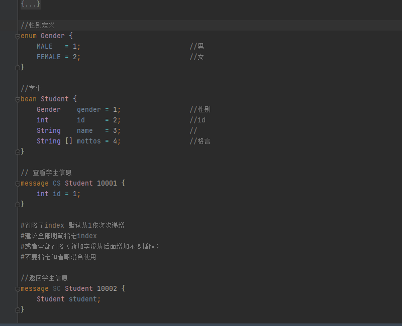

现在可使用[io-generator](senpure-io-generator-ui) 生成目标代码

java enum

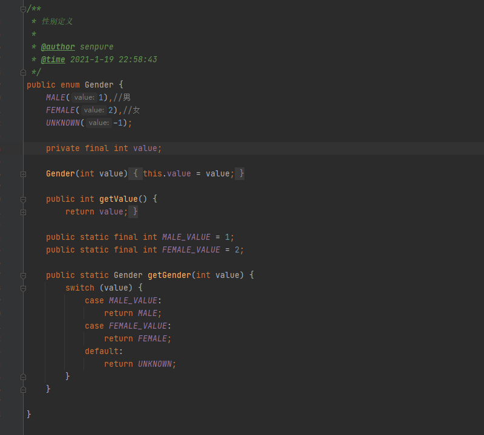

java bean 局部

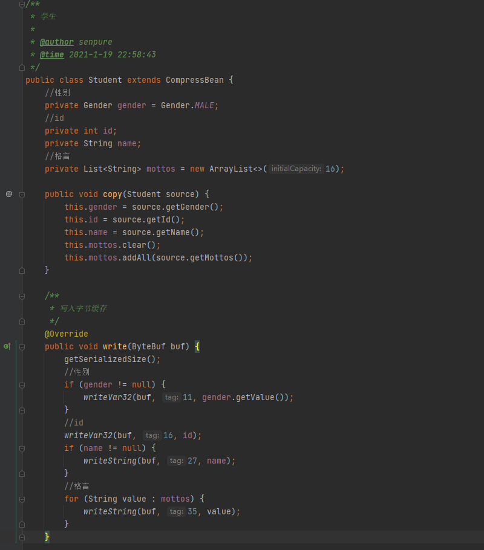

java bean 长图

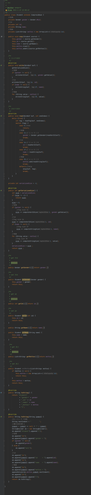

java message 长图

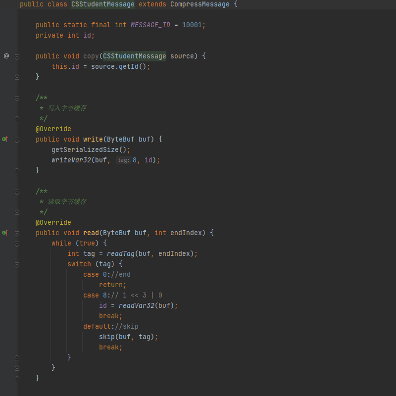

java event

事件和消息一样只是没有cs|sc这样的辅助记忆标识。

java 更加友好的toString

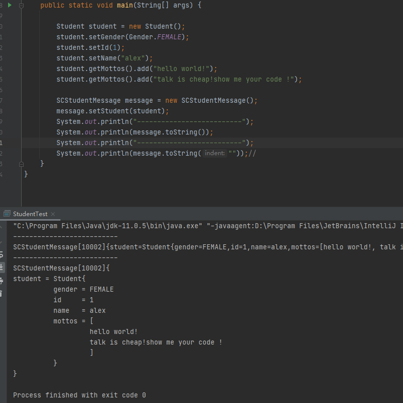

java 同时生成handler

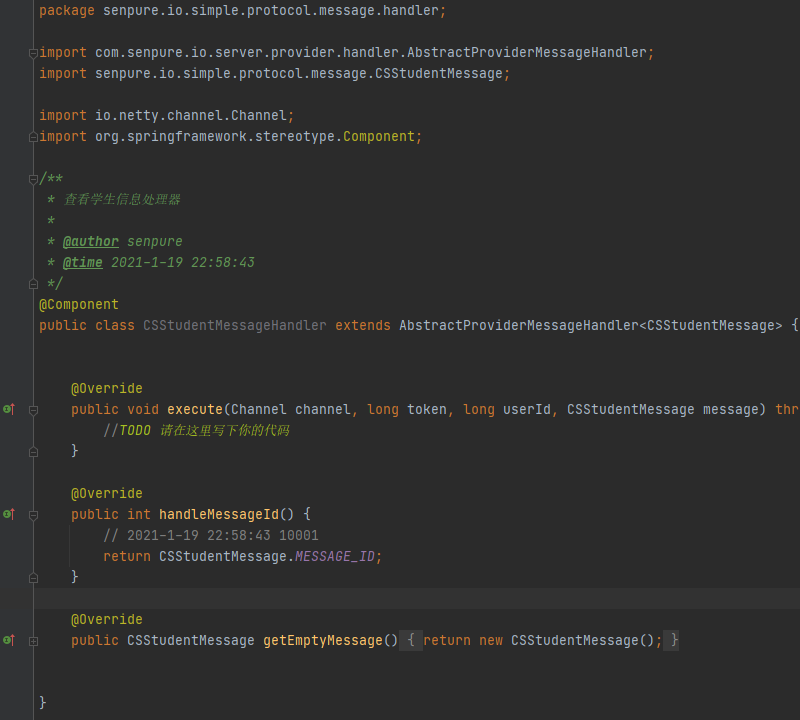

lua mix 截图(还提供了按文件或者按命名空间的生成方式)

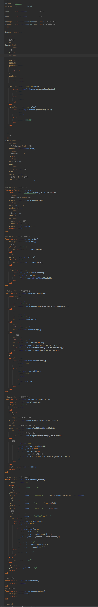

javascript mix 截图(还提供了按文件或者按命名空间的生成方式)

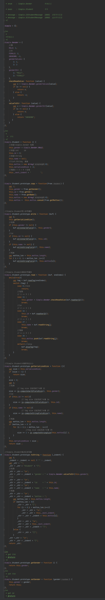

### 语法定义与实现

通过.g4语法定义[io.g4](senpure-io-generator/src/main/resources/Io.g4)

简单的协议定义

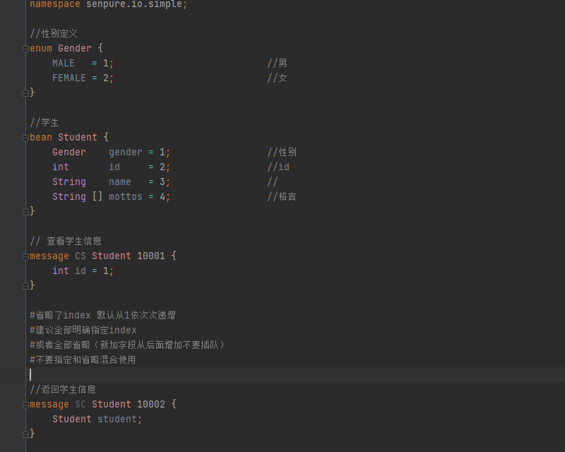

引用已经存在的协议

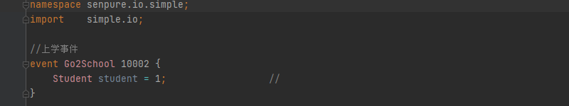

### 关键词说明

|     关键词    | 说明                                                                | 备注             |
|:------------|:--------------------------------------------------------------------|:-----------------|
|namespace | 定义命名空间,不同的命名空间可以定义相同名字的枚举/bean/消息/时间           |可省略 io-generator 默认为 com.senpure.io |
| import  | 导入定义好的协议文件                                                    |  |
| enum  | 定义一个枚举                                                      |  |
| bean  | 定义一个简单对象                                                  |  |
| message| 定义一个消息(包含一个唯一id)                                                  |  |
| event| 定义一个事件(包含一个唯一id)                                                  |  |

### enum 枚举说明

枚举结构描述 可在bean|message(消息)|event(事件)中直接引用

语法

```
//枚举说明
enum enumName {
    枚举字段成员1=字段成员序1号; //字段成成员说明
    枚举字段成员2=字段成员序2号; //字段成成员说明
    ......
}
```

+ 其中（=字段成员序号)可以省略 [io-generator](senpure-io-generator-ui) 将会根据从上到下的顺序从1依次递增 建议全部明确指定index 或者全部省略（新加字段从后面增加不要插队）
  不要指定和省略混合使用

+ //枚举说明和//字段成成员说明属于可选

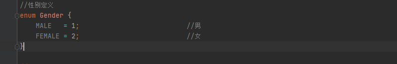

### bean bean说明

简单对象描述 可在bean|message(消息)|event(事件)中直接引用

语法

```
//bean说明
bean beanName {
    bean字段成员1=字段成员序1号; //字段成成员说明
    bean字段成员2=字段成员序2号; //字段成成员说明
    ......
}
```

+ 其中（=字段成员序号)可以省略 [io-generator](senpure-io-generator-ui) 将会根据从上到下的顺序从1依次递增 建议全部明确指定index 或者全部省略（新加字段从后面增加不要插队）
  不要指定和省略混合使用
+ //bean说明 和//字段成成员说明属于可选

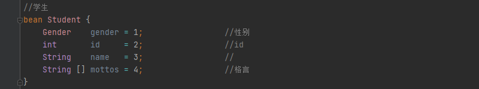

### message 消息说明

消息对象描述 可引用定义好的enum(枚举)和bean

语法

```
//消息说明
message messageType messageName messageId {
    message字段成员1=字段成员序1号; //字段成成员说明
    message字段成员2=字段成员序2号; //字段成成员说明
    ......
}
```

+ 其中（=字段成员序号)可以省略 [io-generator](senpure-io-generator-ui) 将会根据从上到下的顺序从1依次递增 建议全部明确指定index 或者全部省略（新加字段从后面增加不要插队）
  不要指定和省略混合使用
+ //消息说明说明 和//字段成成员说明属于可选
+ messageType值为CS或者SC起到辅助记忆的作用
    + cs通常表示请求(client to server)
    + cs通常表示响应或服务器推送(server to client)
+ messageId 消息唯一表示

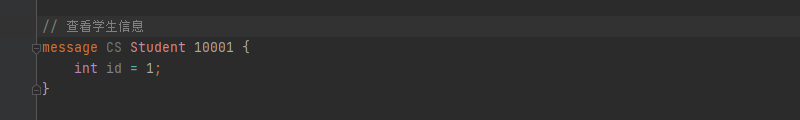
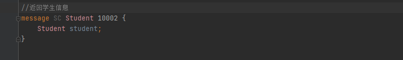

### event 事件说明

事件对象描述 可引用定义好的enum(枚举)和bean

语法

```
//事件说明
event  eventName eventId {
    event字段成员1=字段成员序1号; //字段成成员说明
    event字段成员2=字段成员序2号; //字段成成员说明
    ......
}
```

+ 其中（=字段成员序号)可以省略 [io-generator](senpure-io-generator-ui) 将会根据从上到下的顺序从1依次递增 建议全部明确指定index 或者全部省略（新加字段从后面增加不要插队）
  不要指定和省略混合使用
+ //事件说明和//字段成成员说明属于可选
+ eventId 事件唯一表示

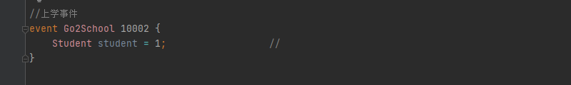

### 序列化与反序列化

##### 序列化

每个字段依次编码 ,先用var32算法编码字段tag，在再根据字段类型编码字段的值

字段 tag等于字段的index右移三位再与wire type取与(index <<3|wire type)


id 的tag=8 1<<3|0

##### 反序列化

依次读取tag 根据tag 可找到对应的字段类型 进行相应的解码 如果tag不存在这根据wire type 进行跳过实现向上兼容

### wire Type

|    wire Type   | 值                                                                | 备注             |
|:------------|:--------------------------------------------------------------------|:-----------------|
| VARINT         | 0        |  |
| FIXED32        |1              |  |
| FIXED64         | 2                   |  |
| LENGTH_DELIMITED    | 3           |  |

### 字段成员说明

|     字段    | 说明  |wire type     |编码算法                                                           | 备注         |
|:------------|:----------|---------------------------|-------------------------------|:-----------------|
| int  | 可变32位数字  |   VARINT               |     var32         |                       |  
| long | 可变64位数字     |    VARINT            |       var64          |                     |  
| sint |   可变32负数优化    |  VARINT            |  先ZigZag32然后 var32                              |
| slong |  可变64负数优化       |  VARINT           |  先ZigZag64然后 var64             |                       |  
| fixed32 | 固定4个字节     |  FIXED32            |    大端32位数字       |                          |  
| fixed64 | 固定8个字节   |  FIXED64             |      大端64位数字                                |
| float |  单精度小数     |   FIXED32             |     大端32位单精度数字         |                        |  
| double |  双精度小数   |   FIXED64              | 大端64位单精度数字                                     |
| boolean | true false  |   VARINT            |     byte true=1 false=0          |                        |  
| String | 字符串  |  LENGTH_DELIMITED    |先装换为bytes类型(默认使用utf-8编码)           | 可使用string |
| bytes | 字节流  |  LENGTH_DELIMITED    |   先var32字节流长度在写入字节流                          |  |
| enum |  引用枚举   |   VARINT     |        取枚举的值进行var32               |  |
| bean |  引用bean   |   LENGTH_DELIMITED   | 先把bean中字段依次的进行编码获得bytes，再按bytes的方式进行编码           |  |

### 字段属性说明
|     属性     | 类型      |说明                                                       | 备注             |
|:------------|:----------|---------------------------------------------------------|:-----------------|
| explain     |String     |   字段注释                     |                                             |
| hasExplain     |boolean    |  字段是否有注释 当explain不为空并且长度大于0时为true                    |               |
| name     |String     |   字段名                   |                                             |
| baseField    |boolean     |   是否属于基本数据类型                     |                                             |
| list     |boolean     |   是否是list列表                    |                                             |
| wireType     |int     |    wire Type的值                   |                                             |
| bytes     |boolean     |    是否是bytes属性的字段                   |                                             |
| listPacked     |boolean     |当list为true是是否打包  并且wireType会变为LENGTH_DELIMITED  | false: tag value1 tag value<br> true: tag value1 value2 value3 |
| javaType     |String|    对应的java类型                 |                                             |
| index     |int   |    字段序号                |                                             |
| tag    |int    |    字段tag(计算完毕)                |                                             |
| bean    |Object   |    该字段为bean时 说对应Bean的信息               |                    |
| 其他   | |             |                    |

### 字段固定取值
|     字段     | base |listPacked                                                           | 备注             |
|:------------|:----------|---------------------------------------------------------|:-----------------|
| int  |true  |true|      |
| long  |true  |true|      |
| sint  |true  |true|      |
| slong |true  |true|      |
| fixed32  |true  |true|      |
| fixed64 |true  |true|      |
| float  |true  |true|      |
| double  |true  |true|      |
| boolean  |true  |true|      |
| String  |true  |false|      |
| bytes  |false  |false|      |
| enum  |false  |true|      |
| bean  |false  |false|      |

### bean属性说明
enum  bean event message 都会转换为bean对外提供访问只是返回的结果不同

|     属性     | 类型      |说明                                                       | 备注             |
|:------------|:----------|---------------------------------------------------------|:-----------------|
| explain     |String     |   字段注释                     |                                             |
| hasExplain     |boolean    |  字段是否有注释 当explain不为空并且长度大于0时为true                    |               |
| namespace     |String     |   命名空间                    |                                             |
| originalName    |String     |  io文件中定义的名字                   |                                             |
| name    |String     |   原始字符首字母大写                   |                                             |
| javaPackage    |String     |   所在的java包                  |                                             |
| fields    |List<Field>   |   该bean所有的字段                |                                             |
| hasBean   |boolean   |   是否包含其他bean              |                                             |
| fieldMaxLen |  int  |       字段的最大长度           |                                             |
| filePath    |String   |   协议文件全路径                |                                             |
| type    |String   |   类型                |           bean :NA message: CS/SC  enum:EM                          |
| lua |  Object  |       lua的相关属性        |                                             |
| js   |Object   |   JavaScript的相关属性               |                                             |


### 编码解码算法

#### var32编码

1. 将数字用二进制补码表示
2. 将数字的二进制补码逆序按7位分组
3. 按分组逆序的方式将每组的补码写入一字节的后7位
4. 如果后面还有有效分组则在字节的第一位写入1，否则在字节的第一位写入0并且编码完成
5. 重复3

全为0且为逆序的最后一个则为无效分组

例子 编码数字      7 
1. 二进制补码      00000000 00000000 00000000 00000111
1. 有效补码        00000111  
3. 按逆序7位分组   0,0000111
4. 逆序分组写入    第一字节低7位写入 0000111 后续分组为 0 为无效分组 第一字节高位写入0 第一字节变为 00000111 完成编码
5. 最终编码为      00000111

例子 编码数字 128
1. 二进制补码      00000000 00000000 00000000 10000000
2. 有效补码       10000000
3. 按逆序7位分组   1,0000000
4. 逆序分组写入    第一字节低7位写入 0000000 后续分组为 1 为有效分组 第一字节高位写入 1 第一字节变为 10000000
5. 逆序分组写入    第二字节低7位写入 0000001 后续没有分组 第二字节高位写入 0 第二字节变为 00000001 完成编码
6. 最终编码为      10000000 00000001

例子 编码数字 666666
1. 二进制补码      00000000 00001010 00101100 00101010
2. 有效补码       00001010 00101100 00101010
3. 按逆序7位分组   101000,1011000,0101010
4. 逆序分组写入    第一字节低7位写入 0101010  后续分组为 1011000 为有效分组 第一字节高位写入 1 第一字节变为 10101010
5. 逆序分组写入    第二字节低7位写入 1011000  后续分组为 101000 为有效分组 第二字节高位写入 1 第二字节变为 11011000 
6. 逆序分组写入    第三字节低7位写入 0101000  后续没有分组 第三字节高位写入 0 第三字节变为 00101000 完成编码
7. 最终编码为      10101010 11011000 00101000

#### var32解码

var32编码的反向操作

1. 读取一个字节如果字节的高位为1则继续读取后一个字节直到字节的最高为0
2. 取每个字节的低7位从低位组成数字的二进制补码

例子 解码数字      7 
1. 已知二进制编码  00000111
2. 读取第一字节为  00000111 字节高位为 0 读取完毕  第一字节有效编码 0000111
3. 字节有效位     0000111
4. 字节有效位组装  0000111
5. 最终解码为     00000000 00000000 00000000 00000111

例子 解码数字      128
1. 已知二进制编码  10000000 00000001
2. 读取第一字节为  10000000 字节高位为 1 继续读取下一位字节 第一字节有效编码 0000000
3. 读取第二字节为  00000001 字节高位为 0 读取完毕 第二字节有效编码 0000001
4. 字节有效位     0000001 0000000 
5. 字节有效位组装  000000 10000000 
6. 最终解码为     00000000 00000000 00000000 10000000 

例子 解码数字      666666
1. 已知二进制编码  10101010 11011000 00101000
2. 读取第一字节为  10101010 字节高位为 1 继续读取下一位字节 第一字节有效编码 0101010
3. 读取第二字节为  11011000 字节高位为 1 继续读取下一位字节 第二字节有效编码 1011000
3. 读取第三字节为  00101000 字节高位为 0 读取完毕 第三字节有效编码 0101000
4. 字节有效位     0101000 1011000 0101010
5. 字节有效位组装  01010 00101100 00101010
6. 最终解码为     00000000 00001010 00101100 00101010 

#### var64编码

同var32编码 

#### var64解码

同var32解码

#### ZigZag32编码

ZigZag32编码的主要作用是将负数转换为正数方便使用var32编码压缩。
将符号位移动到最低位数据整体相对左移1位，负数的二进制补码有很过前导1,
需要消除掉，可以按位取反。
具体步骤如下
1. 数字的二进制补码左移1位获得 a (数据位左移，正数前导为0 负数前导为1)
2. 数字的二进制补码<font color=red>**带符号**</font>右移31位获得 b(符号位到最低位，正数前导补位0，负数前导补位为1)
3. a异或b获得结果(正数0^0等于0不影响，负数1^1等于0刚好消除前导1，负数数据位按位取反了)

即 value << 1 ^ value >> 31

例子 编码数字 7

7的二进制补码为 00000000 00000000 00000000 00000111
1. 左移1位获得a
  + 00000000 00000000 00000000 00001110
2. 右移31位获得b 
  + 00000000 00000000 00000000 00000000
3. a异或b获得c 等于14
  + 00000000 00000000 00000000 00001110

例子 编码数字 -7

-7的二进制补码为 11111111 11111111 11111111 11111001
1. 左移1位获得a
  + 11111111 11111111 11111111 11110010
2. 右移31位获得b
  + 11111111 11111111 11111111 11111111
3. a异或b获得c等于13
  + 00000000 00000000 00000000 00001101


#### ZigZag32解码

ZigZag32解码即编码的逆操作,右移1位获得数据位。
判断符号位是正数还是负数，可使用与1获得符号位。
如果符号位为1数据位需要按位取反。将符号位还原完成解码.
具体步骤可以是要下面的方式

1. 数字的二进制补码<font color=red>**无符号**</font>右移1位获得 a 还原数据位
2. 数字的二进制补码与1，在取负号 获得b (符号为是负数b全是1，符号位是正数b全是0）
3. a异或b获得结果(负数数据位还原了前导1，正数不影响，正负数都能正确获得符号位)

即value >>> 1 ^ -(value & 1)
   
例子 解码数字 14

14的二进制补码 00000000 00000000 00000000 00001110
1. 右移1位获得a
  + 00000000 00000000 00000000 00000111
2. 与1，取负号获得b
  + 00000000 00000000 00000000 00000000
3. a异或b获得c等于7
  + 00000000 00000000 00000000 00000111

例子 解码数字 13

13的二进制补码 00000000 00000000 00000000 00001101
1. 右移1位获得a
+ 00000000 00000000 00000000 00000110
2. 与1，取负号获得b
+ 11111111 11111111 11111111 11111111
3. a异或b获得c等于-7
+ 11111111 11111111 11111111 11111001

#### ZigZag64编码

value << 1 ^ value >> 63

#### ZigZag64解码

value >>> 1 ^ -(value & 1)


