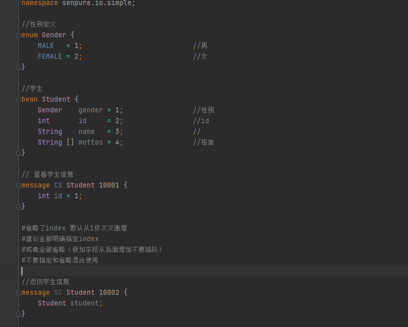
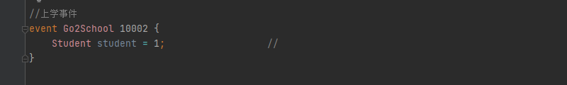
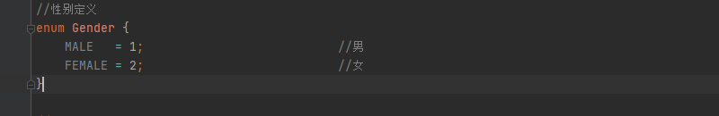
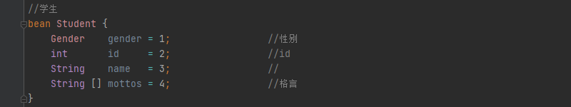
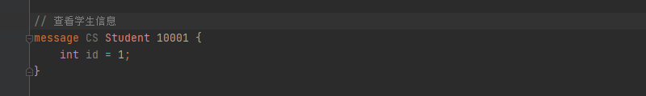
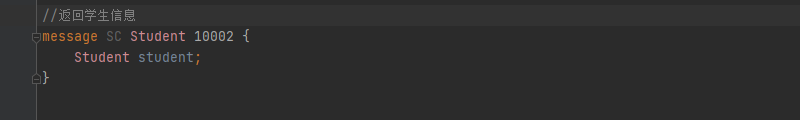

通过自定义的*.io文件方便自定义实现消息的发送与接收

### 语法定义与实现

通过.g4语法定义[io.g4](../senpure-io-generator/src/main/resources/Io.g4)

简单的协议定义



引用已经存在的协议



### 关键词说明

|     关键词    | 说明                                                                | 备注             |
|:------------|:--------------------------------------------------------------------|:-----------------|
|namespace | 定义命名空间,不同的命名空间可以定义相同名字的枚举/bean/消息/时间           |可省略 io-generator 默认为 com.senpure.io |
| import  | 导入定义好的协议文件                                                    |  |
| enum  | 定义一个枚举                                                      |  |
| bean  | 定义一个简单对象                                                  |  |
| message| 定义一个消息(包含一个唯一id)                                                  |  |
| event| 定义一个事件(包含一个唯一id)                                                  |  |

###enum 枚举说明
枚举结构描述 可在bean|message(消息)|event(事件)中直接引用

语法 

```
//枚举说明
enum enumName {
    枚举字段成员1=字段成员序1号; //字段成成员说明
    枚举字段成员2=字段成员序2号; //字段成成员说明
    ......
}
```
+  其中（=字段成员序号)可以省略 io-generator 将会根据从上到下的顺序从1依次递增
建议全部明确指定index
或者全部省略（新加字段从后面增加不要插队）
不要指定和省略混合使用

+  //枚举说明和//字段成成员说明属于可选



###bean bean说明
简单对象描述 可在bean|message(消息)|event(事件)中直接引用

语法

```
//bean说明
bean beanName {
    bean字段成员1=字段成员序1号; //字段成成员说明
    bean字段成员2=字段成员序2号; //字段成成员说明
    ......
}
```
+  其中（=字段成员序号)可以省略 io-generator 将会根据从上到下的顺序从1依次递增
建议全部明确指定index
或者全部省略（新加字段从后面增加不要插队）
不要指定和省略混合使用
+  //bean说明 和//字段成成员说明属于可选



###message 消息说明

消息对象描述 可引用定义好的enum(枚举)和bean

语法

```
//消息说明
message messageType messageName messageId {
    message字段成员1=字段成员序1号; //字段成成员说明
    message字段成员2=字段成员序2号; //字段成成员说明
    ......
}
```
+ 其中（=字段成员序号)可以省略 io-generator 将会根据从上到下的顺序从1依次递增
建议全部明确指定index
或者全部省略（新加字段从后面增加不要插队）
不要指定和省略混合使用
+ //消息说明说明 和//字段成成员说明属于可选 
+ messageType值为CS或者SC起到辅助记忆的作用
    + cs通常表示请求(client to server)
    + cs通常表示响应或服务器推送(server to client)
+ messageId 消息唯一表示    



###event 事件说明
事件对象描述 可引用定义好的enum(枚举)和bean

语法

```
//事件说明
event  eventName eventId {
    event字段成员1=字段成员序1号; //字段成成员说明
    event字段成员2=字段成员序2号; //字段成成员说明
    ......
}
```
+ 其中（=字段成员序号)可以省略 io-generator 将会根据从上到下的顺序从1依次递增
  建议全部明确指定index
  或者全部省略（新加字段从后面增加不要插队）
  不要指定和省略混合使用
+ //事件说明和//字段成成员说明属于可选
+ eventId 事件唯一表示    
  

